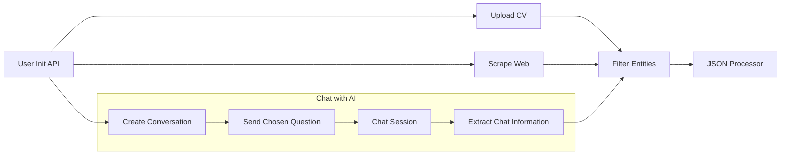
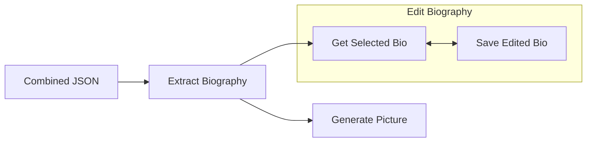

# Documentation for the Personal-AI APIs

This document explains the APIs interactions of the Personal AI backend for the **Karrera - Personal AI** project. It details the entire flow from user creation to the end results, detailing all the methods with their respective inputs and outputs.

## API Interactions

The user will begin by creating a session and then choosing between three different methods for providing the application with information pertaining to himself, searching the web, uploading a resume (CV) or just having a conversation with an AI agent.
All three methods can be used in conjunction and will contribute to a better overall understanding of the user. 

The main order of interaction will be as detailed in the following diagram:

