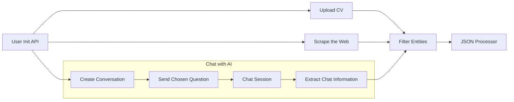
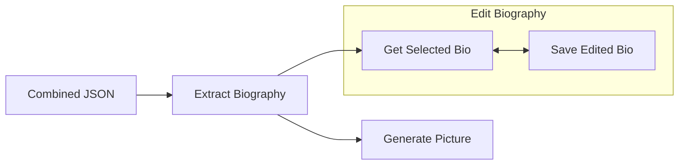

# Documentation for the Personal-AI APIs

This document explains the APIs interactions of the Personal AI backend for the **Karrera - Personal AI** project. It details the entire flow from user creation to the end results, detailing all the methods with their respective inputs and outputs.

## API Interactions

The user will begin by creating a session and then choosing between three different methods for providing the application with information pertaining to himself, searching the web, uploading a resume (CV) or just having a conversation with an AI agent.
All three methods can be used in conjunction and will contribute to a better overall understanding of the user. 

The main order of interaction is detailed in the following diagram:



## APIs Endpoints

### User Init. API:
Creates the **User Session**, saving all necessary arguments for the session in Redis.

* **Endpoint = /user_session_init**  
    * **INPUTS:**
        * user-id = Identifies the user session 
        * name = User full name
    * **RETURNS:**
        * Start the user session in Redis under {user-id}

    ??? info "Redis Arguments:" 
        ```
        .name = name
        .JSON_scrape = ''
        .JSON_cv = ''
        .JSON_chat = ''
        .JSON_scrape_filtered = ''
        .JSON_cv_filtered = ''
        .JSON_chat_filtered = ''
        .JSON_combined = ''
        .bio = ''
        .edited_bio = ''
        .bio_flag = ''
        .working_env = ''
        .user_last_method = ''
        ```
### Upload CV:
Reads a curriculum sent by the user, either in .pdf or .docx, and extracts from it a list of entities and relations related to the user.

* **Endpoint = /cv_reader**  
    * **INPUTS:**
        * user-id = Identifies the user session 
        * file = curriculum document (.pdf or .docx)
        * From Redis:
            * .name = name of the user
    * **RETURNS:**
        * A JSON file saved in Redis under JSON_cv
    
```py title="JSON_example.json" linenums="1"
{
   "entities":[
      {
         "person":[
            {
               "name":"John Jay Doe",
               "description":"Executive with a diverse and international career",
               "date":"",
               "source":[
                  "User-sent Document"
               ]
            }
         ],
         "education":[
            {
               "name":"University Of John'Doe",
               "description":"MBA",
               "date":"2001",
               "source":[
                  "User-sent Document"
               ]
            }
         ],
         "organization":[
            {
               "name":"John Doe Company",
               "description":"Vice President",
               "date":"",
               "source":[
                  "User-sent Document"
               ]
            }
         ],
         "project":[
            {
               "name":"John Doe's Project",
               "description":"Project Description",
               "date":"",
               "source":[
                  "User-sent Document"
               ]
            },
         ],
   "relationships":[
          {
             "source":"John Jay Doe",
             "target":"University Of John'Doe",
             "relationship":"studied at",
             "relationship_strength":4
          },
          {
             "source":"John Jay Doe",
             "target":"John Doe Company",
             "relationship":"worked at",
             "relationship_strength":4
          },
          {
             "source":"John Jay Doe",
             "target":"John Doe's Project",
             "relationship":"created",
             "relationship_strength":2
          },    
   ]
}
```
    
??? info "Redis Arguments:" 

        ```
        .JSON_cv = Returned JSON file
        .user_last_method = 'cv'
        ```

### Scrape the Web:
Searches the user by their name on the web and extracts entities and relations pertaining the user from all the text. 

* **Endpoint = /search_from_web**  
    * **INPUTS:**
        * user-id = Identifies the user session 
        * location = optional, (default: us), alters the location of the search. Accepts any country name or iso code, as per country_converter python library.
        * add-info = optional, (default: ''), adds information related to the user to the search, filtering the results, specially if the name is common or has a famous namesake.
        * From Redis:
            * .name = name of the user
    * **RETURNS:**
        * A JSON file saved in Redis under JSON_scrape
    
```py title="JSON_example.json" linenums="1"
{
   "entities":[
      {
         "person":[
            {
               "name":"John Jay Doe",
               "description":"Executive with a diverse and international career",
               "date":"",
               "source":[
                  "https://www.example-site.com"
               ]
            }
         ],
         "education":[
            {
               "name":"University Of John'Doe",
               "description":"MBA",
               "date":"2001",
               "source":[
                  "https://www.example-site2.com"
               ]
            }
         ],
         "organization":[
            {
               "name":"John Doe Company",
               "description":"Vice President",
               "date":"",
               "source":[
                  "https://www.example-site2.com"
               ]
            }
         ],
         "project":[
            {
               "name":"John Doe's Project",
               "description":"Project Description",
               "date":"",
               "source":[
                  "https://www.example-site3.com"
               ]
            },
         ],
   "relationships":[
          {
             "source":"John Jay Doe",
             "target":"University Of John'Doe",
             "relationship":"studied at",
             "relationship_strength":4
          },
          {
             "source":"John Jay Doe",
             "target":"John Doe Company",
             "relationship":"worked at",
             "relationship_strength":4
          },
          {
             "source":"John Jay Doe",
             "target":"John Doe's Project",
             "relationship":"created",
             "relationship_strength":2
          },    
   ]
}
```

??? info "Redis Arguments:" 

        ```
        .JSON_scrape = Returned JSON file
        .user_last_method = 'scrape'
        ```

### Chat with AI:
Creates a chat between an AI agent and the user. The objective is inquiring about the user professional accomplishments and extract those entities/relations from the conversation.

#### Create Conversation:
If the user already has a biography created on the app, this API generates personalized questions for the user, otherwise it uses generic questions to start.

* **Endpoint = /create_conversation**  
    * **INPUTS:**
        * user-id = Identifies the user session
        * From Redis:
            * .name = name of the user
            * .bio = user biography (optional)
    * **RETURNS:**
        * If .bio is in Redis, returns 5 personalized questions, else returns 5 generic questions.
    
    ??? info "Redis Arguments:" 

        ```
        .history = Creates the chat history
        .questions = json with questions if not using generic questions
        ```

#### Send Chosen Question:
Lets the user choose one of the five questions to start the conversation.

* **Endpoint = /send_chosen_question**  
    * **INPUTS:**
        * user-id = Identifies the user session
        * user-input = One of the questions, chosen by the user
    * **RETURNS:**
        * Appends the chosen question to the chat history.

    ??? info "Redis Arguments:" 

        ```
        .history = Updates the chat history
        ```

#### Chat Session:
Maintains the conversation between the AI agent and the user. 

* **Endpoint = /chat_session**  
    * **INPUTS:**
        * user-id = Identifies the user session
        * user-input = The user answers to the questions
    * **RETURNS:**
        * Keeps returning the chat response and questions until the user exits the conversation.

    ??? info "Redis Arguments:" 

        ```
        .history = Updates the chat history
        ```
#### Extract Chat Information:
Extract a list of entities and relations from a conversation history.

* **Endpoint = /extract_from_chat**  
    * **INPUTS:**
        * user-id = Identifies the user session
        * user-input = One of the questions, chosen by the user
        * From Redis:
            * .name = name of the user
            * .history = conversation history
    * **RETURNS:**
        * A JSON file saved in Redis under JSON_chat

    ??? info "Redis Arguments:" 

        ```
        .JSON_chat = Returned JSON file
        .user_last_method = 'chat'
        ```
### Filter Entities:

### JSON Processor:


## Biography and Picture

### Extract Bio:

### Generate Picture:

### Edit Biography

#### Get Selected Bio:

#### Save Edited Bio:


