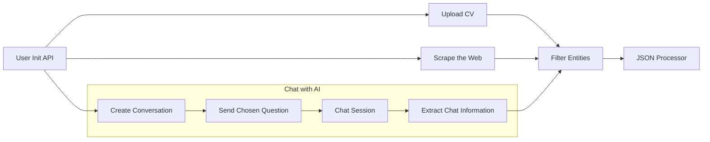
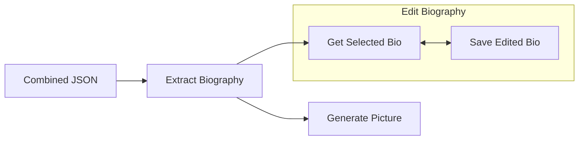

# Documentation for the Personal-AI APIs

This document explains the APIs interactions of the Personal AI backend for the **Karrera - Personal AI** project. It details the entire flow from user creation to the end results, detailing all the methods with their respective inputs and outputs.

## API Interactions

The user will begin by creating a session and then choosing between three different methods for providing the application with information pertaining to himself, searching the web, uploading a resume (CV) or just having a conversation with an AI agent.
All three methods can be used in conjunction and will contribute to a better overall understanding of the user. 

The main order of interaction is detailed in the following diagram:



## APIs Endpoints

### User Init. API:
Creates the **User Session**, saving all necessary arguments for the session in Redis.

* **Endpoint = /user_session_init**
* **Method = POST**
    * **INPUTS:**
        * user-id = Identifies the user session 
        * name = User full name
    * **RETURNS:**
        * Start the user session in Redis under {user-id}

    ??? info "Redis Arguments:" 
        ```
        .name = name
        .JSON_scrape = ''
        .JSON_cv = ''
        .JSON_chat = ''
        .JSON_scrape_filtered = ''
        .JSON_cv_filtered = ''
        .JSON_chat_filtered = ''
        .JSON_combined = ''
        .bio = ''
        .edited_bio = ''
        .bio_flag = ''
        .working_env = ''
        .user_last_method = ''
        ```
### Upload CV:
Reads a curriculum sent by the user, either in .pdf or .docx, and extracts from it a list of entities and relations related to the user.

* **Endpoint = /cv_reader**
* **Method = POST**
    * **INPUTS:**
        * user-id = Identifies the user session 
        * file = curriculum document (.pdf or .docx)
        * From Redis:
            * .name = name of the user
    * **RETURNS:**
        * A JSON file saved in Redis under JSON_cv
    
```py title="JSON_example.json" linenums="1"
{
   "entities":[
      {
         "person":[
            {
               "name":"John Jay Doe",
               "description":"Executive with a diverse and international career",
               "date":"",
               "source":[
                  "User-sent Document"
               ]
            }
         ],
         "education":[
            {
               "name":"University Of John'Doe",
               "description":"MBA",
               "date":"2001",
               "source":[
                  "User-sent Document"
               ]
            }
         ],
         "organization":[
            {
               "name":"John Doe Company",
               "description":"Vice President",
               "date":"",
               "source":[
                  "User-sent Document"
               ]
            }
         ],
         "project":[
            {
               "name":"John Doe's Project",
               "description":"Project Description",
               "date":"",
               "source":[
                  "User-sent Document"
               ]
            },
         ],
   "relationships":[
          {
             "source":"John Jay Doe",
             "target":"University Of John'Doe",
             "relationship":"studied at",
             "relationship_strength":4
          },
          {
             "source":"John Jay Doe",
             "target":"John Doe Company",
             "relationship":"worked at",
             "relationship_strength":4
          },
          {
             "source":"John Jay Doe",
             "target":"John Doe's Project",
             "relationship":"created",
             "relationship_strength":2
          },    
   ]
}
```
    
??? info "Redis Arguments:" 

        ```
        .JSON_cv = Returned JSON file
        .user_last_method = 'cv'
        ```

### Scrape the Web:
Searches the user by their name on the web and extracts entities and relations pertaining the user from all the text. 

* **Endpoint = /search_from_web**
* **Method = POST**
    * **INPUTS:**
        * user-id = Identifies the user session 
        * location = optional, (default: us), alters the location of the search. Accepts any country name or iso code, as per country_converter python library.
        * add-info = optional, (default: ''), adds information related to the user to the search, filtering the results, specially if the name is common or has a famous namesake.
        * From Redis:
            * .name = name of the user
    * **RETURNS:**
        * A JSON file saved in Redis under JSON_scrape
    
```py title="JSON_example.json" linenums="1"
{
   "entities":[
      {
         "person":[
            {
               "name":"John Jay Doe",
               "description":"Executive with a diverse and international career",
               "date":"",
               "source":[
                  "https://www.example-site.com"
               ]
            }
         ],
         "education":[
            {
               "name":"University Of John'Doe",
               "description":"MBA",
               "date":"2001",
               "source":[
                  "https://www.example-site2.com"
               ]
            }
         ],
         "organization":[
            {
               "name":"John Doe Company",
               "description":"Vice President",
               "date":"",
               "source":[
                  "https://www.example-site2.com"
               ]
            }
         ],
         "project":[
            {
               "name":"John Doe's Project",
               "description":"Project Description",
               "date":"",
               "source":[
                  "https://www.example-site3.com"
               ]
            },
         ],
   "relationships":[
          {
             "source":"John Jay Doe",
             "target":"University Of John'Doe",
             "relationship":"studied at",
             "relationship_strength":4
          },
          {
             "source":"John Jay Doe",
             "target":"John Doe Company",
             "relationship":"worked at",
             "relationship_strength":4
          },
          {
             "source":"John Jay Doe",
             "target":"John Doe's Project",
             "relationship":"created",
             "relationship_strength":2
          },    
   ]
}
```

??? info "Redis Arguments:" 

        ```
        .JSON_scrape = Returned JSON file
        .user_last_method = 'scrape'
        ```

### Chat with AI:
Creates a chat between an AI agent and the user. The objective is inquiring about the user professional accomplishments and extract those entities/relations from the conversation.

#### Create Conversation:
If the user already has a biography created on the app, this API generates personalized questions for the user, otherwise it uses generic questions to start.

* **Endpoint = /create_conversation**
* **Method = GET**
    * **INPUTS:**
        * user-id = Identifies the user session
        * From Redis:
            * .name = name of the user
            * .bio = user biography (optional)
    * **RETURNS:**
        * If .bio is in Redis, returns 5 personalized questions, else returns 5 generic questions.
    
```py title="personalized_questions_example.json"
{
    "1": {
        "message": "Hi John Doe, can you tell us about your experience as Vice President at John Doe Company?",
        "topic": "Leadership Positions"
    },
    "2": {
        "message": "Hello John Doe, what inspired you to pursue an MBA from the University Of John'Doe, and how has it impacted your career?",
        "topic": "Education"
    },
    "3": {
        "message": "Hi John Doe, can you walk us through your experience as Executive Director of Technology at John Doe's Business?",
        "topic": "Leadership Positions"
    },
    "4": {
        "message": "Hello John Doe, can you share with us your experience as Co-Founder at John Doe's Second Business, and what motivated you to start this venture?",
        "topic": "Entrepreneurship"
    },
    "5": {
        "message": "Hi John Doe, how do you stay up-to-date with the latest trends and technologies in your field, and how do you apply them in your work?",
        "topic": "Professional Development"
    }
}
```

```py title="chat history"
[
    {
        "role": "user",
        "content": [
            {
                "text": "Let's start this conversation!"
            }
        ]
    },
    {
        "role": "system",
        "content": "1749650098.343819"
    }
]
```
    
??? info "Redis Arguments:" 

    ```
    .history = Creates the chat history
    .questions = json with questions if not using generic questions
    ```

#### Send Chosen Question:
Lets the user choose one of the five questions to start the conversation.

* **Endpoint = /send_chosen_question**
* **Method = POST**
    * **INPUTS:**
        * user-id = Identifies the user session
        * user-input = One of the questions, chosen by the user
    * **RETURNS:**
        * Appends the chosen question to the chat history.

```py title="user-input (first question chosen)"
{
    "user-input": "Hello John Doe, what inspired you to pursue an MBA from the University Of John'Doe, and how has it impacted your career?"
}
```

```py title="updated history"
[
    {
        "role": "user",
        "content": [
            {
                "text": "Let's start this conversation!"
            }
        ]
    },
    {
        "role": "system",
        "content": "1749650098.343819"
    },
    {
        "role": "assistant",
        "content": [
            {
                "text": "Hello John Doe, what inspired you to pursue an MBA from the University Of John'Doe, and how has it impacted your career?"
            }
        ]
    },
    {
        "role": "system",
        "content": "1749651681.779023"
    }
]
```

??? info "Redis Arguments:" 

    ```
    .history = Updates the chat history with chosen question
    ```

#### Chat Session:
Maintains the conversation between the AI agent and the user. 

* **Endpoint = /chat_session**  
* **Method = POST**
    * **INPUTS:**
        * user-id = Identifies the user session
        * user-input = The user answers to the questions
    * **RETURNS:**
        * Keeps returning the chat response and questions until the user exits the conversation.

```py title="user-input (answers)"
{
    "user-input": "I pursued my MBA at the University of John Doe primarily to broaden my business acumen beyond my specialized field and to gain leadership skills for more strategic roles."
}
```

```py title="conversation history"
[
    {
        "role": "user",
        "content": [
            {
                "text": "Let's start this conversation!"
            }
        ]
    },
    {
        "role": "system",
        "content": "1749650098.343819"
    },
    {
        "role": "assistant",
        "content": [
            {
                "text": "Hello John Doe, what inspired you to pursue an MBA from the University Of John'Doe, and how has it impacted your career?"
            }
        ]
    },
    {
        "role": "system",
        "content": "1749651681.779023"
    },
    {
        "role": "user",
        "content": [
            {
                "text": "I pursued my MBA at the University of John Doe primarily to broaden my business acumen beyond my specialized field and to gain leadership skills for more strategic roles."
            }
        ]
    },
    {
        "role": "system",
        "content": "1749652482.474502"
    },
    {
        "role": "assistant",
        "content": [
            {
                "text": "Let's move on to your work experience. You've held various leadership positions, including Vice President at John Doe's Business. What specific challenges did you face in this role, and how did you overcome them?"
            }
        ]
    },
    {
        "role": "system",
        "content": "1749652483.2849646"
    },
    {
        "role": "user",
        "content": [
            {
                "text": "At John Doe's Business, as VP, one significant challenge was prioritizing product development with limited resources while balancing diverse customer needs and market trends. We were a growing company, and everyone had great ideas, but we couldn't pursue them all at once. To overcome this, I implemented a more data-driven product roadmap strategy."
            }
        ]
    },
    {
        "role": "system",
        "content": "1749652526.8790202"
    },
    ...
]
```

??? info "Redis Arguments:" 

    ```
    .history = Updates the chat history with the entire conversation
    ```

#### Extract Chat Information:
Extract a list of entities and relations from a conversation history.

* **Endpoint = /extract_from_chat**
* **Method = POST**
    * **INPUTS:**
        * user-id = Identifies the user session
        * From Redis:
            * .name = name of the user
            * .history = conversation history
    * **RETURNS:**
        * A JSON file saved in Redis under JSON_chat

```py title="JSON_example.json" linenums="1"
{
   "entities":[
      {
         "person":[
            {
               "name":"John Jay Doe",
               "description":"The person in the conversation"
            }
         ],
         "education":[
            {
               "name":"University Of John'Doe",
               "description":"A university where John Jay Doe earned his MBA"
            },
            {
               "name":"University Of John'Doe",
               "description":"A university mentioned in the conversation"
            }
         ],
         "organization":[
            {
               "name":"John Doe's Business",
               "description":"A company where John Jay Doe worked as VP"
            },
            {
               "name":"John Doe's Business",
               "description":"A company co-founded by John Jay Doe"
            }
         ]
      }
   ],
   "relationships":[
      {
         "source":"John Jay Doe",
         "target":"University Of John'Doe",
         "relationship":"earned MBA from",
         "relationship_strength":4
      },
      {
         "source":"John Jay Doe",
         "target":"University Of John'Doe",
         "relationship":"pursued MBA from",
         "relationship_strength":4
      },
      {
         "source":"John Jay Doe",
         "target":"John Doe's Business",
         "relationship":"worked as VP",
         "relationship_strength":4
      },
      {
         "source":"John Jay Doe",
         "target":"John Doe's Business",
         "relationship":"co-founded",
         "relationship_strength":4
      },
      {
         "source":"John Jay Doe",
         "target":"John Doe's Business",
         "relationship":"implemented data-driven product roadmap",
         "relationship_strength":3
      },
      {
         "source":"John Jay Doe",
         "target":"John Doe's Business",
         "relationship":"identified market gap and created solution",
         "relationship_strength":3
      }
   ]
}
```

??? info "Redis Arguments:" 

    ```
    .JSON_chat = Returned JSON file
    .user_last_method = 'chat'
    ```

### Filter Entities and JSON Processor:
This API will be called after any data aquiring API, the front end will pass all the entities found on the used method (CV, Web Search or Chat) and presents it to the user. This API will receive all entities selected that the user thinks represents his person and add them to a JSON file called JSON_combined. 
This JSON file will have all the information selected by the user from all the methods he ever used, serving as a collection of all his extracted entities.  

* **Endpoint = /json_processor**
* **Method = POST**
    * **INPUTS:**
        * user-id = Identifies the user session
        * json file = the entities selected by the user, to filter the json, will be saved as .chosen_entities in Redis.
        * From Redis:
            * .name = name of the user
            * .JSON_combined = if it already exists otherwise it's created
            * .user_last_method = cv, scrape or chat, to know which json is being filtered
            * .JSON_scrape/cv/chat = the json file from which the user came from (as in .user_last_method)
    * **RETURNS:**
        * A JSON file saved in Redis under JSON_combined

```py title="chosen_entities json format"
{
    "categories": [
        {
            "type": "Person",
            "tag": "John Jay Doe"
        },
        {
            "type": "Organization",
            "tag": "John Doe's Business"
        },
        {
            "type": "Education",
            "tag": "University Of John'Doe"
        },
        {
            "type": "Organization",
            "tag": "John Doe's Second Business"
        },
        {
            "type": "Organization",
            "tag": "John Doe Company"
        }
    ]
}
```

```py title="JSON_combined_example.json" linenums="1"
{
   "person":[
      {
         "name":"John Jay Doe",
         "description":"Executive with a diverse and international career",
         "date":"",
         "source":[
            "User-sent Document"
         ]
      }
   ],
   "organization":[
      {
         "name":"John Doe's Business",
         "description":"Vice President",
         "date":"",
         "source":[
            "https://www.example-site2.com"
         ]
      },
      {
         "name":"John Doe's Second Business",
         "description":"Executive Director of Tecnology",
      },
      {
         "name":"John Doe Company",
         "description":"Co-Founder",
         "date":"",
         "source":[
            "User-sent Document"
         ]
      }
   ],
   "education":[
      {
         "name":"University Of John'Doe",
         "description":"MBA",
      }
   ]
}
```

??? info "Redis Arguments:" 

    ```
    .JSON_scrape/cv/chat_filtered = The respective json file but with only the entities selected by the user
    .user_last_method = '' ; after passing this method the user_last_method is reset so that the user can run another method from the start
    .JSON_combined = will have all entities selected by the user appended to it as long as they're not repeated
    ```

## Biography and Picture

### Extract Bio:

### Generate Picture:

### Edit Biography

#### Get Selected Bio:

#### Save Edited Bio:


