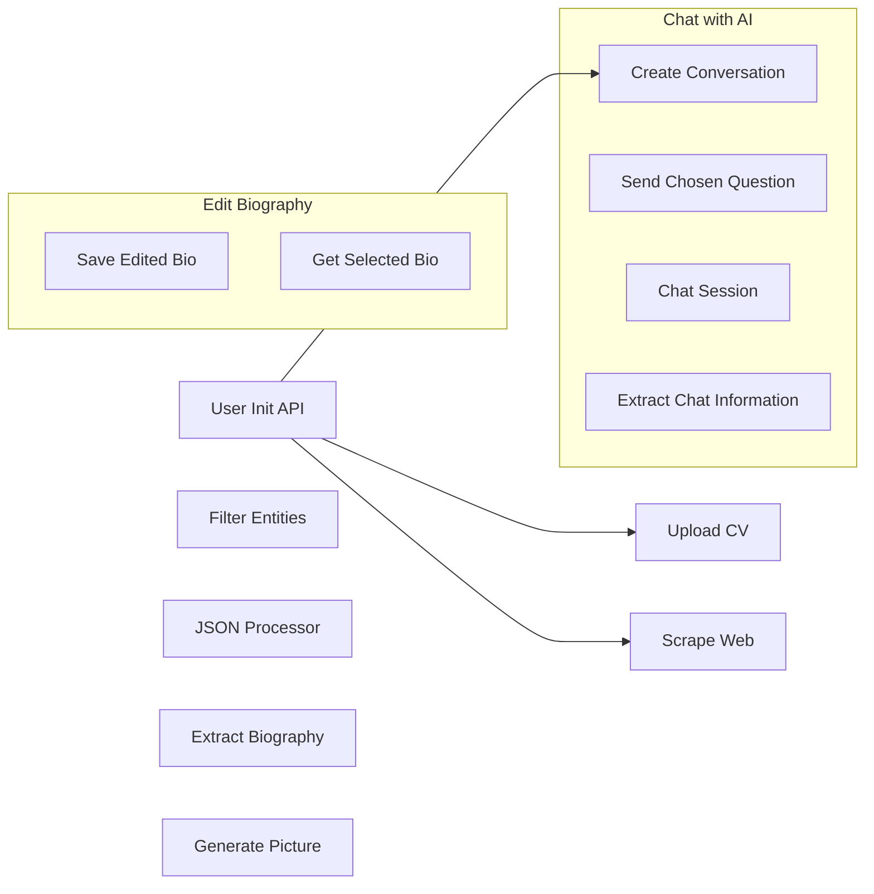

# Documentation for the Personal-AI APIs

```mermaid
graph LR
    A[User Init API]
    B[Upload CV]
    C[Scrape Web]
    subgraph Chat with AI
        direction LR
        D1[Create Conversation]
        D2[Send Chosen Question]
        D3[Chat Session]
        D4[Extract Chat Information]
    end
    E[Filter Entities]
    F[JSON Processor]
    G[Extract Biography]
    H[Generate Picture]
    subgraph Edit Biography
        I1[Save Edited Bio]
        I2[Get Selected Bio]
    end
    
    A --> B
    A --> C
    A --> D1 
```