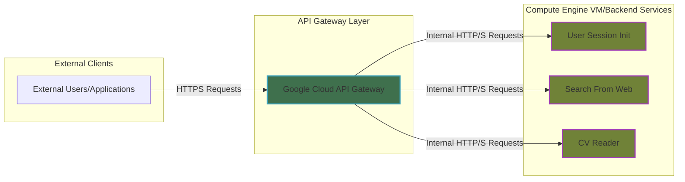

# API Gateway Setup Documentation

This document explains the setup of the API Gateway for the project **Karrera - Personal AI** project using Google Cloud API Gateway. The backend services are hosted on **Google Compute Engine (VM)**, and the API is defined using **OpenAPI 2.0**. It explains how to use Google Cloud's fully managed API Gateway to securely expose an application running on a Compute Engine Virtual Machine (VM). This approach is ideal for centralizing API access, providing API key enforcement, and decoupling clients from your backend VM's network details, all without managing gateway infrastructure yourself.

## Overview: Managed API Gateways for VM backends

Google's API Gateway acts as a single entry point for all API calls, sitting in front of your backend services. When your backend is a Compute Engine VM, the API Gateway provides a managed layer that handles:
* **Traffic Management**: Routes incoming requests to your VM application.
* **Security**: Enforces API keys, providing a crucial layer of access control before requests even reach your VM.
* **Decoupling**: Hides the VM's internal IP address and specific network configuration from external clients.
* **Observability**: Integrates seamlessly with Cloud Monitoring and Cloud Logging for request tracing and performance insights.
* **Scalability**: The gateway itself is a serverless service, automatically scaling to handle traffic.

This setup simplifies operations compared to running a custom gateway (self-managed) on a VM, as Google manages the gateway infrastructure, patching, and scaling.

---

## Architecture

In this architecture, the Google Cloud API Gateway acts as a proxy for your application running on a Compute Engine VM.

- **Client**: Makes requests to the public URL provided by the API Gateway.
- **GCP API Gateway**: 
    - Receives external API requests.
    - Enforces configured security policies (e.g., API key validation).
    - Routes validated requests to your Compute Engine VM using its internal IP address.
    - Handles response forwarding back to the client.
- **Backend**: Flask API running on a Google Cloud VM
    - Hosts your API application (e.g., a web server, microservice).
    - Listens for incoming requests on a specific port, typically on its internal IP address.
    - Does not require an external IP address for direct client access, as all traffic is routed through the API Gateway.



---
## Implementation Steps:
### Step 1: Check for appropriate permissions in GCP (Recommended IAM Roles and Best Practices):

Since we are running a VM on GCP, and working using this cloud, we firstly have to make sure we have the appropriate permissions to create and work on the API Gateway in Google Cloud, including the configuration of API key enforcement.

**Principle of Least Privilege:** When assigning permissions, it's a security best practice to follow the Principle of Least Privilege (POLP). This means granting only the minimum permissions necessary for a task, rather than broad roles like "Owner" or "Editor," which provide excessive access and increase security risks.

#### Recommended Predefined IAM Roles

For a user or service account involved in creating, deploying, and managing an API Gateway with API key enforcement, the following roles are a good starting point:

1.  **API Gateway Admin (`roles/apigateway.admin`)**
    * **Why it's used:** This role grants comprehensive permissions for managing API Gateway resources directly. It allows the creation, updating, retrieval, and deletion of API definitions, API configurations (derived from your OpenAPI spec), and the API Gateway instances themselves.
    * **How it's used:** Essential for the core operations of setting up and modifying your API Gateway, such as deploying new OpenAPI configurations or updating gateway settings.

2.  **Service Management Administrator (`roles/servicemanagement.admin`)**
    * **Why it's used:** API Gateway relies on Google Cloud's Service Management infrastructure. When you deploy an API Gateway configuration, a "managed service" is created (e.g., `your-api.apigateway.your-project.cloud.goog`). This role provides the necessary permissions to create and manage these underlying services. This is often the critical role when encountering "address not enabled for the project" errors.
    * **How it's used:** Enables the API Gateway to register its service in Service Management, making it discoverable and manageable within your project.

3.  **Service Usage Admin (`roles/serviceusage.admin`)**
    * **Why it's used:** This role allows users to enable and disable Google Cloud APIs and services within a project. It's crucial for ensuring that necessary APIs (like the API Gateway API itself) are active for your project.
    * **How it's used:** Used to enable the core `API Gateway API` (`apigateway.googleapis.com`) and other Google APIs that your backend services might rely on.

4.  **API Keys Admin (`roles/serviceusage.apiKeysAdmin`)**
    * **Why it's used:** This role provides permissions for managing API keys, including creating, listing, updating, and deleting them. It's essential for generating and restricting the API keys that your clients will use to authenticate with your API Gateway.
    * **How it's used:** Necessary for creating the API key in the Google Cloud Console and, crucially, for restricting it to your specific API Gateway service, ensuring it's only valid for your API.

5.  **Compute Network Viewer (`roles/compute.networkViewer`) or Compute Network User (`roles/compute.networkUser`)**
    * **Why it's used:**  While API Gateway itself doesn't need to manage VM instances, the user deploying the gateway might need to view or interact with network resources (like internal IPs, firewall rules) to correctly configure the `x-google-backend.address` and ensure network connectivity.
    * **How it's used:** To retrieve the VM's internal IP and verify firewall configurations.


#### **Important Considerations**

* **Service Accounts for Automation:**
    * Always use a dedicated **service account** instead of a user account.
    * Grant this service account *only* the specific roles listed above. This minimizes the blast radius of any potential security breaches.

* **Enabling Necessary APIs:**
    * Before deploying your API Gateway, ensure that the core Google Cloud APIs it relies on are enabled in your project.
    * **Key APIs to enable:**
        * **API Gateway API** (`apigateway.googleapis.com`)
        * **The specific API Gateway created** -- after its creation: When you deploy an API configuration to API Gateway, Google Cloud automatically creates a unique "managed service" in the background that represents your API. This service needs to be explicitly enabled in your project before the API Gateway can properly serve traffic and enforce API key restrictions. If this service is not enabled, you might encounter `PERMISSION_DENIED` errors, indicating that the API targeted by the request is not enabled for the project.

            Here's how to enable it:

            1.  **Identify The Managed Service Name:**
                * During the API Config creation step (e.g., Step 3.2 in the full deployment guide), you should have noted down the "Managed Service" name. It typically follows this pattern: `YOUR_API_ID.apigateway.YOUR_PROJECT_ID.cloud.goog`.
                * If you don't have it, you can find it by navigating to **API Gateway > APIs** in the Google Cloud Console, selecting your API, and looking for the "Managed Service" column or property in the API details.

            2.  **Enable the Service via API Library:**
                * In the **Google Cloud Console**, go to **APIs & Services > Library**.
                * In the search bar provided, paste or type the **exact Managed Service name** you identified in the previous step (e.g., `my-api-12345.apigateway.my-project.cloud.goog`).
                * The search results should display your API's managed service. Click on it.
                * On the service's details page, click the **ENABLE** button.

            Once enabled, allow a few moments for the changes to propagate throughout Google Cloud's infrastructure. After this, your API Gateway should be ready to correctly route requests and enforce its configured security policies.

* **API Key Restrictions (Crucial Security Practice):**
    * After creating an API key in Google Cloud, it is **imperative** to restrict it.
    * **How to restrict:**
        1.  Go to **APIs & Services > Credentials** in the Google Cloud Console.
        2.  Edit your API key.
        3.  Under "API restrictions," choose "Restrict key."
        4.  Select your specific API Gateway service (e.g., `YOUR_API_NAME.apigateway.YOUR_PROJECT_ID.cloud.goog`) from the dropdown.
        5.  Additionally, you might want to restrict it to other relevant Google APIs like `API Gateway API` and `Service Control API`.
    * **Why it's important:** Restricting API keys ensures they can only be used to access the specific services you intend, preventing unauthorized access to other resources in your project if the key is compromised.

### Step 2: Define API Specification

- **Purpose**:  Create an OpenAPI (Swagger 2.0) specification file (e.g., api-gateway-spec.yaml) that describes your API and tells the API Gateway how to route requests to your VM backend.
- **Activities**:
    1. Define the basic info:
        - Standard: ***Swagger/OPEN API 2.0***
        - Title, Description, and Version of Configuration
    2. Define all endpoints, methods, and expected behaviors
    3. Document request/response formats using OpenAPI 2.0 standards
    4. Specify path parameters, query strings, and body schemas
    5. Map API services to backend services, and define the timeout limit (600s)
    6. Add security scheme definitions (API keys for now)

- **Key elements for a VM backend**:
    * ***`x-google-backend.address`***: This is the most crucial part. It must point to the internal IP address and port of your Compute Engine VM.
    * ***`securityDefinitions` and `security`***: For API Key enforcement.
    
- **Output**: Here's a small version of the OpenAPI spec used:

```yaml 
# Basic information
swagger: "2.0"
info:
  title: "API Gateway Configuration Test"
  description: "Test of Gateway"
  version: 1.0.0

# Enforce API Key security
securityDefinitions:
  api_key:
    type: "apiKey"
    name: "x-api-key"
    in: "header"

# Require the api_key security scheme (defined above) for all paths and methods unless overridden.
security:
- api_key: []

# Sinece most of the methods consume and produce json texts, define a basic expected behavior (can be overriden)
consumes:
  - application/json
produces:
  - application/json

# Define the backend address
x-google-backend:
  address: http://<YOUR_VM_INTERNAL_IP>:<YOUR_APP_PORT> 
  deadline: 600.0 ## the timeout limit, in seconds

# Define each endpoint under paths
paths:
   # Endpoint name
  /user_session_init:
    # Endpoint request type
    post:
      # Write the basic information of this microsservice
      operationId: userSessionInit
      summary: Initializes a user session in Redis
      description: Initializes a user session in Redis using the `name` and `user-id` from request headers.
      
      # Write down what parameters the method takes
      parameters:
        - in: header # Where the parameter goes in the request
          name: name # Name of the key
          type: string # Type of the parameter
          required: true # If it is required or not
        - in: header
          name: user-id
          type: string
          required: true
      
      # Define Responses (required, but since we have already defined responses in our methods, not really necessary -- we can specify it later)
      responses:
        200:
          description: OK
```

> [!IMPORTANT] 
> Replace <YOUR_VM_INTERNAL_IP> and <YOUR_APP_PORT> with the Karrera VM's internal IP and the port.

### Step 3: Create and Deploy the API Gateway
1. **Enable API Gateway API:**
    * Go to APIs & Services > Library in the GCP Console.
    * Search for **"API Gateway API"** and ensure it's enabled.
2. **Create API Config:**
    * In the GCP Console, navigate to **API Gateway > APIs**.
    * Click **CREATE API**.
    * Give your API a display name (e.g., `vm-backend-api`).
    * Click **BROWSE** under "API spec" and upload your `api-gateway-spec.yaml `file.
    * Click **CONTINUE**.
    * Take note of the "Managed Service" name (e.g., `my-api-12345.apigateway.my-project.cloud.goog`). This is important for API key restrictions.
    * Click **CREATE API CONFIG**.
3. **Create Gateway:**
    * Once the API Config is created, navigate to **API Gateway > Gateways**.
    * Click **CREATE GATEWAY**.
    * **Gateway name**: Choose a unique name (e.g., `my-vm-gateway`).
    * **Region**: Select a region. Ideally, one close to your VM to minimize latency.
    * **API**: Select the API you just created (e.g., vm-backend-api).
    * **API config**: Select the API config you just created.
    * Click **CREATE GATEWAY**.
    * Wait for the gateway to deploy. Once complete, you'll see a default URL for your gateway (e.g., `https://my-vm-gateway-abc12def.ts.gateway.cloud.goog`).

### Step 4: API Key Management

API Keys provide a simple yet effective mechanism for controlling access to your API Gateway. Proper management and restriction of these keys are vital for security.

1.  **Create an API Key:**
    * Navigate to the **Google Cloud Console**.
    * Go to **APIs & Services > Credentials**.
    * Click on **CREATE CREDENTIALS > API Key**.
    * A new API key string will be automatically generated. **Copy this key immediately** as you will need it for testing and client applications.

2.  **Restrict the API Key (Crucial for Security):**
    Once created, an API key is by default unrestricted, meaning it could potentially be used to access any enabled API in your project. This is a significant security risk. The API key **must** be restricted to only allow access to the specific API Gateway.
    * On the same **Credentials** page, locate the newly created API key.
    * Click the **EDIT API KEY** icon (pencil) next to it.
    * Under the **API restrictions** section, select the **Restrict key** radio button.
    * From the "Select APIs" dropdown menu, select the following APIs:
        * **`API Gateway API`** (`apigateway.googleapis.com`)
        * **Your specific Managed Service name** (e.g., `my-api-12345.apigateway.my-project.cloud.goog`). You would have obtained this name during the API Config creation step (typically Step 3.2 in the full deployment guide).
    * Click **OK** to confirm your selections.
    * Finally, click **SAVE** at the bottom of the page to apply the restrictions.

### Step 5: Testing Your API Gateway

Thorough testing is essential to confirm that your API Gateway is correctly configured, routing traffic, and enforcing API key security.

1.  **Test with API Key (Expected Success):**
    This test verifies that your API Gateway accepts valid API keys and successfully routes requests to your backend application.
    * Open an API client like Postman, curl, or any preferred tool.
    * Construct a request to your API Gateway's public URL. The URL format will be `https://<YOUR_GATEWAY_URL>/<YOUR_API_PATH>` (e.g., `https://my-vm-gateway-abc12def.ts.gateway.cloud.goog/my-app-endpoint`).
    * **Include a header:** Add an `X-API-Key` header with the API key you copied from Step 4.1.
        ```
        X-API-Key: <YOUR_API_KEY>
        ```
        (Replace `<YOUR_API_KEY>` with your actual generated key.)
    * Send the request.
    * **Expected Outcome:** You should receive a successful HTTP `200 OK` response (or whatever success code your backend application returns) from your VM application, indicating the request was processed correctly.

2.  **Test without API Key (Expected Failure):**
    This test confirms that your API Gateway's API key enforcement is active and blocking unauthorized access.
    * Make the same request to your API Gateway URL as in the previous test.
    * **Crucially, do NOT include** the `X-API-Key` header in this request.
    * Send the request.
    * **Expected Outcome:** You should receive an HTTP `401 Unauthorized` or `403 Forbidden` response. This indicates that the API Gateway successfully detected the missing API key and blocked the unauthorized request, confirming your security measures are working.

## Step 6: Monitoring and Logging

Google Cloud API Gateway is deeply integrated with Cloud Logging and Cloud Monitoring, providing out-of-the-box observability for your API traffic and performance.

1.  **Cloud Logging (For Request Details and Errors):**
    Cloud Logging captures detailed logs for every request handled by your API Gateway, providing insights into traffic flow, latency, and any issues encountered.
    * In the Google Cloud Console, navigate to **Logging > Logs Explorer**.
    * In the "Resource" filter, select `API Gateway Gateway`.
    * You will see log entries for each request, including:
        * HTTP status codes (e.g., 200, 401, 500)
        * Request latency
        * Source IP addresses
        * Details on backend communication
        * Error messages (if any)
    * You can use the query builder to filter logs by `method`, `status`, `request_id`, and other parameters to troubleshoot specific issues.

2.  **Cloud Monitoring (For Metrics and Performance):**
    Cloud Monitoring allows you to observe the performance and health of your API Gateway over time through various metrics.
    * In the Google Cloud Console, go to **Monitoring > Metrics Explorer**.
    * In the "Metric" selector, search for "API Gateway" metrics. Key metrics to monitor include:
        * **`gateway/request_count`**: Total number of requests received.
        * **`gateway/error_count`**: Number of requests resulting in errors.
        * **`gateway/request_latencies`**: Distribution of request latencies (useful for P50, P90, P99 analysis).
        * **`gateway/consumed_bytes_count` / `gateway/produced_bytes_count`**: Data transfer.
    * You can create **custom dashboards** to visualize these metrics tailored to your needs.
    * Set up **alerts** based on thresholds (e.g., alert if error rate exceeds X% or latency goes above Y ms) to be proactively notified of potential issues.

---